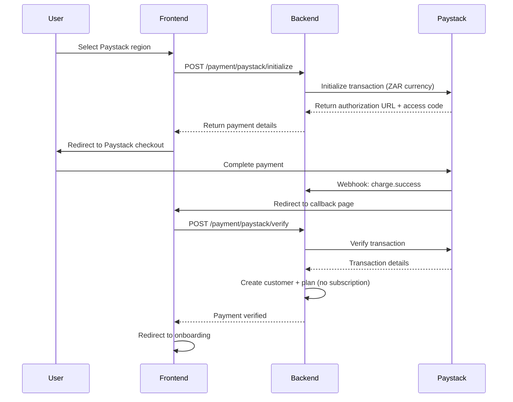

# Paystack Integration Guide

## Overview

This document outlines the complete Paystack payment integration for Beauty N Brushes, including the current trial-first approach and the production-ready subscription flow.

## Current Implementation (Trial-First Approach)

### How It Works

1. **User selects Paystack region** (Ghana/Nigeria)
2. **No immediate payment collection** - user starts 2-month free trial
3. **Payment collection happens later** when trial ends (via email notifications)
4. **Subscription management** through Paystack dashboard

### Files Involved

#### Backend Files

- `backend/src/controllers/payment.controller.ts` - Paystack transaction initialization
- `backend/src/controllers/webhook.controller.ts` - Webhook handling for payment events
- `backend/src/routes/payment.routes.ts` - Payment API routes
- `backend/src/lib/payment.ts` - Payment service logic
- `backend/src/routes/webhook.routes.ts` - Webhook routes

#### Frontend Files

- `frontend/src/components/provider/PaystackCardForm.tsx` - Paystack payment form
- `frontend/src/app/onboarding/payment-callback/page.tsx` - Payment callback handler
- `frontend/src/lib/api.ts` - API client for payment endpoints
- `shared-types/payment.types.ts` - TypeScript interfaces

### Current Flow



## Production Implementation (Full Subscription Flow)

### When Trial Ends - Payment Collection

To implement the full subscription flow when trials end, follow these steps:

#### 1. Email Notification System

Create email templates to notify users before trial ends:

```typescript
// backend/src/templates/email/trial-ending.html
// backend/src/templates/email/trial-expired.html
```

#### 2. Payment Collection Endpoint

Create an endpoint to collect payment when trial ends:

```typescript
// backend/src/controllers/payment.controller.ts

export async function collectPaystackPayment(
  req: Request,
  res: Response,
  next: NextFunction
): Promise<void> {
  const { userId } = req.params;
  const { email, amount, currency, subscriptionTier, regionCode } = req.body;

  // Initialize Paystack transaction
  const response = await fetch('https://api.paystack.co/transaction/initialize', {
    method: 'POST',
    headers: {
      Authorization: `Bearer ${env.PAYSTACK_SECRET_KEY}`,
      'Content-Type': 'application/json',
    },
    body: JSON.stringify({
      email,
      amount: amount * 100, // Convert to kobo/pesewas
      currency,
      callback_url: `${env.FRONTEND_URL}/dashboard/subscription/payment-callback?provider=paystack&userId=${userId}`,
      metadata: {
        userId,
        subscriptionTier,
        regionCode,
        type: 'subscription_renewal',
      },
    }),
  });

  // Return authorization URL for redirect
  const data = await response.json();
  sendSuccess(res, {
    authorizationUrl: data.data.authorization_url,
    accessCode: data.data.access_code,
    reference: data.data.reference,
  });
}
```

#### 3. Subscription Creation After Payment

Update the payment callback to create subscriptions:

```typescript
// backend/src/controllers/webhook.controller.ts

async function handlePaystackChargeSuccess(data: any): Promise<void> {
  if (data.metadata?.type === 'subscription_renewal') {
    const userId = data.metadata.userId;
    const provider = await prisma.providerProfile.findFirst({
      where: { userId },
    });

    if (provider) {
      // Create Paystack subscription
      const subscription = await paystack.subscription.create({
        customer: provider.paystackCustomerCode,
        plan: provider.paystackPlanCode,
        authorization: data.authorization.authorization_code,
      });

      // Update provider profile
      await prisma.providerProfile.update({
        where: { id: provider.id },
        data: {
          paystackSubscriptionCode: subscription.data.subscription_code,
          subscriptionStatus: 'ACTIVE',
          trialEndDate: null,
          nextBillingDate: new Date(Date.now() + 30 * 24 * 60 * 60 * 1000), // 30 days
        },
      });
    }
  }
}
```

#### 4. Frontend Payment Collection Page

Create a payment collection page for trial renewals:

```typescript
// frontend/src/app/dashboard/subscription/payment-collection/page.tsx

export default function PaymentCollectionPage() {
  const handlePaystackPayment = async () => {
    const response = await api.payment.collectPaystackPayment(userId, {
      email: user.email,
      amount: monthlyFee,
      currency: 'ZAR',
      subscriptionTier: 'solo',
      regionCode: 'GH',
    });

    // Redirect to Paystack checkout
    window.location.href = response.data.authorizationUrl;
  };

  return (
    <div>
      <h1>Complete Your Subscription</h1>
      <p>Your trial has ended. Please add your payment method to continue.</p>
      <Button onClick={handlePaystackPayment}>
        Pay with Paystack
      </Button>
    </div>
  );
}
```

### Webhook Events to Handle

#### Production Webhooks

```typescript
// backend/src/controllers/webhook.controller.ts

switch (event.event) {
  case 'subscription.create':
    // Subscription created successfully
    await handlePaystackSubscriptionCreated(event.data);
    break;

  case 'subscription.disable':
    // User cancelled subscription
    await handlePaystackSubscriptionDisabled(event.data);
    break;

  case 'subscription.not_renew':
    // Subscription won't renew (user cancelled)
    await handlePaystackSubscriptionNotRenew(event.data);
    break;

  case 'charge.success':
    // Successful payment (trial renewal)
    await handlePaystackChargeSuccess(event.data);
    break;

  case 'charge.failed':
    // Payment failed
    await handlePaystackChargeFailed(event.data);
    break;
}
```

## Configuration

### Environment Variables

```bash
# Paystack Configuration
PAYSTACK_SECRET_KEY=sk_test_xxx  # or sk_live_xxx for production
PAYSTACK_PUBLIC_KEY=pk_test_xxx  # or pk_live_xxx for production

# Currency Configuration
PAYSTACK_DEFAULT_CURRENCY=ZAR    # Based on your dashboard settings
```

### Regional Currency Mapping

```typescript
const PAYSTACK_CURRENCIES = {
  GH: 'GHS', // Ghana Cedis
  NG: 'NGN', // Nigerian Naira
  ZA: 'ZAR', // South African Rand (your current setup)
};
```

## Testing

### Test Cards (ZAR)

```typescript
// Test card details for ZAR currency
const TEST_CARDS = {
  visa: '4084084084084081',
  mastercard: '5531886652142950',
  cvv: '408',
  expiry: '09/32',
  pin: '3310',
};
```

### Test Flow

1. Use test Paystack account with ZAR currency enabled
2. Use test card numbers above
3. Monitor webhook events in Paystack dashboard
4. Check backend logs for webhook processing

## Security Considerations

### Webhook Verification

Always verify webhook signatures:

```typescript
const hash = crypto
  .createHmac('sha512', process.env.PAYSTACK_SECRET_KEY || '')
  .update(rawBody)
  .digest('hex');

if (hash !== paystackSignature) {
  // Invalid webhook - reject
  return;
}
```

### Raw Body Handling

Use `express.raw()` middleware for webhook routes:

```typescript
router.post(
  '/paystack',
  express.raw({ type: 'application/json' }),
  webhookController.handlePaystackWebhook
);
```

## Migration from Trial to Production

### Steps to Enable Full Subscription Flow

1. **Update Paystack settings** - Enable subscription plans in dashboard
2. **Create subscription plans** - Set up monthly billing plans
3. **Update webhook URLs** - Point to production webhook endpoints
4. **Test payment collection** - Verify trial-to-paid conversion
5. **Update frontend** - Add payment collection pages
6. **Email notifications** - Implement trial ending notifications

### Database Changes

Ensure these fields exist in `ProviderProfile`:

```sql
paystackCustomerCode VARCHAR
paystackPlanCode VARCHAR
paystackSubscriptionCode VARCHAR
subscriptionStatus ENUM('TRIAL', 'ACTIVE', 'PAST_DUE', 'CANCELLED')
trialEndDate TIMESTAMP
nextBillingDate TIMESTAMP
```

## Monitoring & Analytics

### Key Metrics to Track

- Trial-to-paid conversion rate
- Payment success rate
- Webhook delivery success rate
- Subscription cancellation rate

### Logging

```typescript
logger.info(`Paystack subscription created: ${data.subscription_code}`);
logger.error('Paystack webhook processing failed:', error);
```

## Support & Troubleshooting

### Common Issues

1. **Currency not supported** - Verify currency in Paystack dashboard
2. **Webhook signature mismatch** - Check raw body handling
3. **Transaction verification fails** - Ensure proper reference handling

### Debug Mode

Enable detailed logging:

```typescript
if (process.env.NODE_ENV === 'development') {
  logger.info('Paystack webhook received:', JSON.stringify(event, null, 2));
}
```

## Future Enhancements

### Planned Features

1. **Automatic retry logic** for failed payments
2. **Prorated billing** for mid-cycle upgrades
3. **Multiple payment methods** support
4. **Subscription analytics** dashboard
5. **Dunning management** for failed payments

### Integration Opportunities

1. **Mobile money** integration for African markets
2. **Bank transfer** support for Nigeria
3. **QR code payments** for in-person transactions
4. **Recurring billing** optimization

---

**Last Updated**: October 17, 2025  
**Version**: 1.0  
**Status**: Production Ready (Trial Mode Active)
